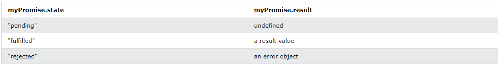

# 비동기
## 콜백
- 다른 함수에 인수로 전달되는 함수
- 함수가 다른 함수를 호출할 수 있는데 콜백 함수의 경우 다른 함수가 완료된 후에 실행할 수 있다.

### 기능 순서
- java script 함수는 호출된 순서대로 실행됨. 정의돈 순서 x
```
function myFirst() {
  myDisplayer("Hello");
}

function mySecond() {
  myDisplayer("Goodbye");
}

myFirst();
mySecond();
```
실행결과 : Goodbye

```
function myFirst() {
  myDisplayer("Hello");
}

function mySecond() {
  myDisplayer("Goodbye");
}

mySecond();
myFirst();
```
실행결과 : Hello

- 순서를 제어하고 싶다면?
```
function myDisplayer(some) {
  document.getElementById("demo").innerHTML = some;
}

function myCalculator(num1, num2) {
  let sum = num1 + num2;
  return sum;
}

let result = myCalculator(5, 5);
myDisplayer(result);
```
or
```
function myDisplayer(some) {
  document.getElementById("demo").innerHTML = some;
}

function myCalculator(num1, num2) {
  let sum = num1 + num2;
  myDisplayer(sum);
}

myCalculator(5, 5);
```
- 이와 같이 변수를 통한 호출이나 함수 내에서 호출을 통하여 순서를 제어할 수 있다.
- 하지만 첫 번째는 결과를 표시하기 위해 두 개의 함수를 호출해야하고 두 번째는 계산기 기능의 결과를 표시하는 것을 막을 수 없다는 것이다.
- 이러한 문제점을 콜백함수가 해결할 수 있다.

### 콜백
- <b>콜백은 다른 함수에 인수로 전달되는 함수<b>
```
function myDisplayer(some) {
  document.getElementById("demo").innerHTML = some;
}

function myCalculator(num1, num2, myCallback) { // 함수를 인수로 전달할땐 괄호를 사용하지 않는다.
  let sum = num1 + num2;
  myCallback(sum);
}

myCalculator(5, 5, myDisplayer);
```
- 콜백을 사용하면 콜백과 함께 계산기 함수를 호출하고 계산이 완료된 후 계산기 함수가 콜백을 실행하도록 할 수 있다.
- 콜백은 주로 비동기 함수에서 한 함수가 다른 함수를 기다려야할 때 사용된다.

## 비동기식
- 다른 함수와 병렬로 실행되는 함수를 비동기식이라고 함
- setTimeout() 함수를 사용하면 시간 초과시 실행할 콜백 함수를 지정할 수 있다.
```
setTimeout(myFunction, 3000);

function myFunction() {
  document.getElementById("demo").innerHTML = "I love You !!";
}
```
<br>

```
setTimeout(function() { myFunction("I love You !!!"); }, 3000);

function myFunction(value) {
  document.getElementById("demo").innerHTML = value;
}
```
<br>

- setInterval() 함수를 사용하면 일정 간격으로 반복되는 함수를 지정할 수 있다.
```
setInterval(myFunction, 1000);

function myFunction() {
  let d = new Date();
  document.getElementById("demo").innerHTML=
  d.getHours() + ":" +
  d.getMinutes() + ":" +
  d.getSeconds();
}
```
<br>

- 파일의 경우 스크립트나 파일과 같은 외부 리소스를 로드하는 함수를 생성하면 완전히 로드되기 전에는 콘텐츠를 사용할 수 없다.
- 아래의 예에서는 mycar.html을 로드하고 파일이 완전히 로드된 후 html 파일을 웹 페이지에 표시한다.
```
function myDisplayer(some) {
  document.getElementById("demo").innerHTML = some;
}

function getFile(myCallback) {
  let req = new XMLHttpRequest();
  req.open('GET', "mycar.html");
  req.onload = function() {
    if (req.status == 200) {
      myCallback(this.responseText);
    } else {
      myCallback("Error: " + req.status);
    }
  }
  req.send();
}

getFile(myDisplayer);
```
mycar.html
```


<p>A car is a wheeled, self-powered motor vehicle used for transportation.
Most definitions of the term specify that cars are designed to run primarily on roads, to have seating for one to eight people, to typically have four wheels.</p>

<p>(Wikipedia)</p>

```

## Promise
- 코드 생성과 코드 소비를 연결하는 JavaScript 객체
```
let myPromise = new Promise(function(myResolve, myReject) {
// "Producing Code" (May take some time)

  myResolve(); // when successful
  myReject();  // when error
});

// "Consuming Code" (Must wait for a fulfilled Promise)
myPromise.then(
  function(value) { /* code if successful */ },
  function(error) { /* code if some error */ }
);
```

- 생성 코드가 결과를 얻으면 두 콜백 중 하나를 호출해야한다.
성공 : myResolve(결과)
실패 : myReject(오류 객체)

### Promise 객체 속성
<br><br>

### Promise 사용법
```
myPromise.then(
  function(value) { /* code if successful */ },
  function(error) { /* code if some error */ }
);
```
- Promise.then()은 성공을 위한 콜백과 실패를 위한 또 다른 두 개의 인수를 취한다.
- 둘 다 선택 사항이므로 성공 또는 실패에 대해서만 콜백을 추가할 수 있다.
```
function myDisplayer(some) {
  document.getElementById("demo").innerHTML = some;
}

let myPromise = new Promise(function(myResolve, myReject) {
  let x = 0;

// The producing code (this may take some time)

  if (x == 0) {
    myResolve("OK");
  } else {
    myReject("Error");
  }
});

myPromise.then(
  function(value) {myDisplayer(value);},
  function(error) {myDisplayer(error);}
);
```

- 위의 시간 초과를 Promise를 사용한 예시
```
let myPromise = new Promise(function(myResolve, myReject) {
  setTimeout(function() { myResolve("I love You !!"); }, 3000);
});

myPromise.then(function(value) {
  document.getElementById("demo").innerHTML = value;
});
```

- 파일 기다리는 것을 사용한 예시
```
let myPromise = new Promise(function(myResolve, myReject) {
  let req = new XMLHttpRequest();
  req.open('GET', "mycar.htm");
  req.onload = function() {
    if (req.status == 200) {
      myResolve(req.response);
    } else {
      myReject("File not Found");
    }
  };
  req.send();
});

myPromise.then(
  function(value) {myDisplayer(value);},
  function(error) {myDisplayer(error);}
);
```

## async, await
- async : 함수가 Promise를 변환하도록 함
- await : 함수가 Promise를 기다리게 함
----------------------------------------
```
async function myFunction() {
  return "Hello";
}
```
위는 아래와 같다.
```
function myFunction() {
  return Promise.resolve("Hello");
}
```

고로 아래와 같이 사용이 가능하다.
```
async function myFunction() {
  return "Hello";
}
myFunction().then(
  function(value) {myDisplayer(value);},
  function(error) {myDisplayer(error);}
);
```
-------------------------------------
- await 경우 promise를 기다리게 하는 경우 사용됨
- await가 되면 Promise가 처리될 때까지 기다리게 된다.
```
async function myDisplay() {
  let myPromise = new Promise(function(resolve, reject) {
    resolve("I love You !!");
  });
  document.getElementById("demo").innerHTML = await myPromise;
}

myDisplay();
```
- resolve와 reject 2개의 인수는 JavaScript에 의해 미리 정의된다.
- 직접적으로 생성하지 않아도 둘중 하나를 호출하게 된다.
- reject의 경우는 자주 필요하진 않다.

1. 시간 초과 기다리는 예시
```
async function myDisplay() {
  let myPromise = new Promise(function(resolve) {
    setTimeout(function() {resolve("I love You !!");}, 3000);
  });
  document.getElementById("demo").innerHTML = await myPromise;
}

myDisplay();
```

2. 파일 기다리는 예시
```
async function getFile() {
  let myPromise = new Promise(function(resolve) {
    let req = new XMLHttpRequest();
    req.open('GET', "mycar.html");
    req.onload = function() {
      if (req.status == 200) {
        resolve(req.response);
      } else {
        resolve("File not Found");
      }
    };
    req.send();
  });
  document.getElementById("demo").innerHTML = await myPromise;
}

getFile();
```