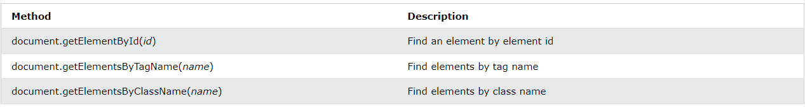
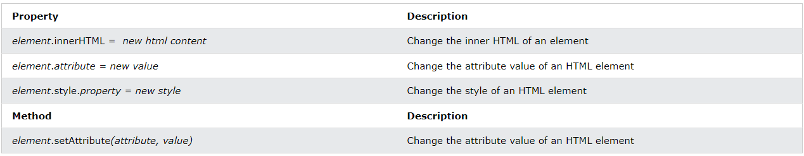
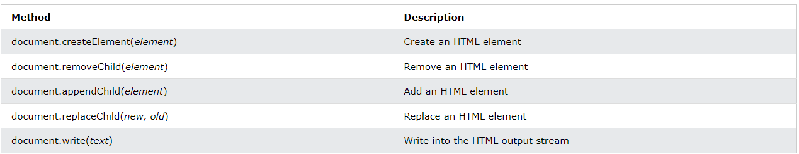
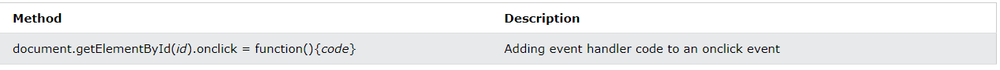
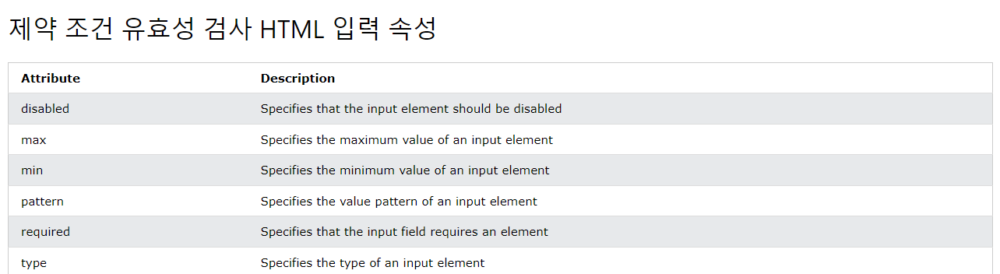
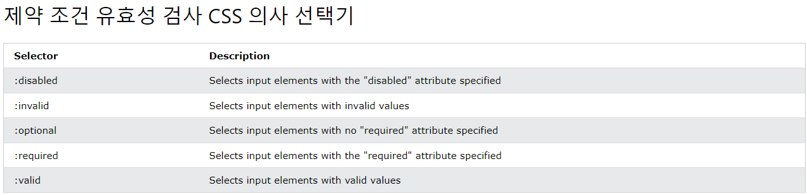
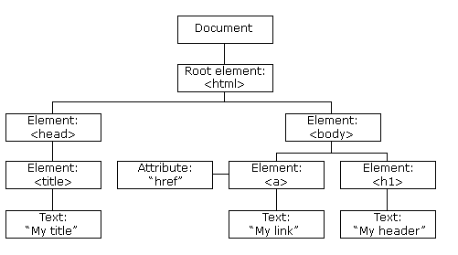
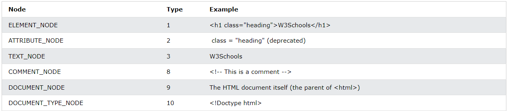

# DOM (Document Object Model)
- 페이지가 로드될 때, 브라우저는 페이지의 DOM을 생성
- DOM이란 트리 형식으로 구성된 객체 모델
- W3C의 표준으로 프로그램과 스크립트가 문서의 콘첸츠, 구조 및 스타일에 동적으로 엑세스하고 업데이트할 수 있도록 하는 플랫폼 및 언어 중립적 인터페이스
    1. Core DOM : 모든 문서 유형에 대한 표준 모델
    2. XML DOM : XML 문서의 표준 모델
    3. HTML DOM : HTML 문서의 표준 모델
- HTML DOM은 HTML 요소를 가져오고, 변경하고, 추가하거나 삭제하는 방법에 대한 표준

## HTML DOM 메소드
- HTML DOM 메소드는 HTML 요소에서 수행할 수 있는 작업
- HTML DOM 속성은 설정하거나 변경할 수 있는 HTML 요소의 값
- DOM에서 모든 HTML 요소는 객체로 정의
- 프로그래밍 인터페이스는 각 객체의 속성과 메소드
    1. 속성 : HTML 요소의 내용을 변경하는 등 가져오거나 설정할 수 있는 값
    2. 메소드 : 추가 또는 HTML 요소를 삭제하는 등 의 작업
```
<html>
<body>

<p id="demo"></p>

<script>
document.getElementById("demo").innerHTML = "Hello World!";
</script>

</body>
</html>
```
- 여기서 getElementByID는 메소드, innerHTML은 속성을 나타낸다.
- getElementByID : HTML 요소에 액세스하는 가장 일반적인 방법으로 id를 받아오는 방법
- innerHTML : 요소의 내용을 가져오는 가장 일반적인 방법. HTML 요소의 내용을 가져오거나 바꾸는데 유용

## 자바스크립트 HTML DOM 문서
- HTML DOM 문서 객체는 웹 페이지를 나타낸다.
- 페이지 요소에 접근하려면 항상 문서 개체에 액세스하는 것으로 시작
***
### HTML 요소 찾기
<br><br>

***
### HTML 요소 변경
<br><br>

***
### HTML 요소 추가 및 삭제
<br><br>

***
### 이벤트 핸들러 추가
<br><br>

***
### HTML 개체 찾기
<br><https://www.w3schools.com/js/js_htmldom_document.asp><br>


## HTML DOM 요소 찾기
- 요소 찾기에는 여러 방법이 존재
1. ID (getElementByID)
2. 태그 (getElementByTagName)
3. 클래스 (getElementByClassName)
4. CSS 선택기 (querySelectorAll)
5. HTML 개체 컬랙션
    1. anchors
    2. body
    3. documentElement
    4. embeds
    5. forms
    6. head
    7. images
    8. links
    9. scripts
    10. title

##  HTML 변경하기
1. 콘텐츠 변경 - document.getElementById(id).innerHTML = new HTML
```
<html>
<body>

<p id="p1">Hello World!</p>

<script>
document.getElementById("p1").innerHTML = "New text!";
</script>

</body>
</html>
```

2. 속성 값 변경 - document.getElementById(id).attribute = new value
```
<!DOCTYPE html>
<html>
<body>


<script>
document.getElementById("myImage").src = "landscape.jpg";
</script>

</body>
</html>
```

3. 동적 HTML 콘텐츠
```
<!DOCTYPE html>
<html>
<body>

<script>
document.getElementById("demo").innerHTML = "Date : " + Date(); </script>

</body>
</html>
```

4. document.write()
```
<!DOCTYPE html>
<html>
<body>

<p>Bla bla bla</p>

<script>
document.write(Date());
</script>

<p>Bla bla bla</p>

</body>
</html>
```

## 자바스크립트 양식
- if문으로 양식 검증
- 유효성 검사 : required
```
<form action="/action_page.php" method="post">
  <input type="text" name="fname" required>
  <input type="submit" value="Submit">
</form>
```
- 데이터 유효성 검사
    1. 사용자가 모든 필수 필드를 채웠는가?
    2. 사용자가 유효한 날짜를 입력했는가?
    3. 사용자가 숫자 필드에 텍스트를 입력했는가?
    4. 서버 측  유효성 검사 : 입력이 서버로 전송된 후 웹 서버에서 수행
    5. 클라이언트 측 유효성 검사 : 입력이 웹 서버로 전송되기 전에 웹 브라우저에서 수행

- HTML 제약 조건 유효성 검사
<br><br><br>

## CSS 변경
### HTML 스타일 변경
**document.getElementById(id).style.property = new style**
```
<html>
<body>

<p id="p2">Hello World!</p>

<script>
document.getElementById("p2").style.color = "blue";
</script>

</body>
</html>
```

### 이벤트 사용
```
<!DOCTYPE html>
<html>
<body>

<h1 id="id1">My Heading 1</h1>

<button type="button"
onclick="document.getElementById('id1').style.color = 'red'">
Click Me!</button>

</body>
</html>
```

## DOM 애니메이션
```
<!DOCTYPE html>
<html>
<style>
#container {
  width: 400px;
  height: 400px;
  position: relative;
  background: yellow;
}
#animate {
  width: 50px;
  height: 50px;
  position: absolute;
  background-color: red;
}
</style>
<body>

<p><button onclick="myMove()">Click Me</button></p> 

<div id ="container">
  <div id ="animate"></div>
</div>

<script>
function myMove() {
  let id = null;
  const elem = document.getElementById("animate");   
  let pos = 0;
  clearInterval(id);
  id = setInterval(frame, 5);
  function frame() {
    if (pos == 350) {
      clearInterval(id);
    } else {
      pos++; 
      elem.style.top = pos + "px"; 
      elem.style.left = pos + "px"; 
    }
  }
}
</script>

</body>
</html>
```
1. 애니메이션 컨테이너 만들기 - 컨테이너의 요소는 style = "position : relatvie"
2. 애니메이션 객체 만들기 - 객체의 요소는 style = "position : absolute"

## DOM 이벤트
### 이벤트 종류
1. 마우스를 클릭할 때 - onclick, onmousedown, onmouseup
2. 웹페이지가 로드될 때 - onload
3. 이미지가 로드될 때
4. 마우스가 요소 위로 이동할 때 - onmouseover, onmouseout
5. 입력 필드가 변경된 경우 - onchange
6. HTML 양식이 제출될 때
7. 사용자가 키를 입력할 때

- onclick으로 클릭시 이벤트 할당 가능
    1. <button onclick="displayDate()">Try it</button>
    2. document.getElementById("myBtn").onclick = displayDate;

## DOM 이벤트 리스너
### addEventListener()
- 지정된 요소에 대한 이벤트 핸들러 첨부
- 기존 이벤트 핸들러를 덮어쓰지 않고 이벤트 핸들러를 요소에 연결 -> 하나의 요소에 여러 이벤트 핸들러 추가가능
- 모든 DOM 객체에 이벤트 리스너 추가 가능
- element.addEventListener(event, function, useCapture(선택사항));

### 요소에 이벤트 핸들러 추가
```
element.addEventListener("click", myFunction);

function myFunction() {
  alert ("Hello World!");
}
```

### 동일한 요소에 많은 이벤트 핸들러 추가
```
element.addEventListener("mouseover", myFunction);
element.addEventListener("click", mySecondFunction);
element.addEventListener("mouseout", myThirdFunction);
```

### 창 개체에 이벤트 처리기 추가
```
window.addEventListener("resize", function(){
  document.getElementById("demo").innerHTML = sometext;
});
```
- 창 크기가 변경되는 것을 감지

### 매개변수 전달 가능
```
element.addEventListener("click", function(){ myFunction(p1, p2); });
```

### 세번째 매개변수
- default는 false
- true인 경우 캡처, false인 경우 버블링
- 버블링 : 외부보다 대부분의 내부 이벤트가 먼저 다뤄짐
- 캡처 : 내부보다 대부분의 외부 이벤트가 먼저 다뤄짐
```
<div id="myDiv1">
  <h2>Bubbling:</h2>
  <p id="myP1">Click me!</p>
</div><br>

<div id="myDiv2">
  <h2>Capturing:</h2>
  <p id="myP2">Click me!</p>
</div>

<script>
document.getElementById("myP1").addEventListener("click", function() {
  alert("You clicked the white element!");
}, false);

document.getElementById("myDiv1").addEventListener("click", function() {
  alert("You clicked the orange element!");
}, false);

document.getElementById("myP2").addEventListener("click", function() {
  alert("You clicked the white element!");
}, true);

document.getElementById("myDiv2").addEventListener("click", function() {
  alert("You clicked the orange element!");
}, true);
</script>
```
- 버블링의 경우 내부 Click me!를 클릭했을 때 내부(p)가 먼저 실행되고 외부(div)가 실행된다.
- 캡처의 경우 내부 Click me!를 클릭했을 때 외부(div)가 먼저 실행되고 내부(p)가 실행된다.

### removeEventListener()
- 연결된 이벤트 핸들러 제거
- element.removeEventListener("mousemove", myFunction);

## DOM 탐색
### DOM 노드
- HTML 문서의 모든 것은 노드
- HTML 요소 내부의 텍스트는 텍스트 노드
- 모든 HTML 속성은 소석 노드
- 모든 주석은 주석 노드
<br><br>

### 노드 관계
```
<html>

  <head>
    <title>DOM Tutorial</title>
  </head>

  <body>
    <h1>DOM Lesson one</h1>
    <p>Hello world!</p>
  </body>

</html>
```
- `<html>`은 루트 노드이다.
- `<html>`은 부모가 없다.
- `<html>`은 `<head>`와 `<body>`의 부모 노드이다.
- `<head>`는 `<html>`의 첫번째 자식 노드이다.
- `<body>`는 `<html>`의 마지막 자식 노드이다.
- `<head>`는 `<title>`이라는 자식 노드가 있다.
- `<title>`은 "DOM Tutorial"이라는 자식 텍스트 노드가 있다.
- `<body>`에는 2가지의 자식 노드(`<h1>`, `<p>`)가 있다.
- `<h1>`에는 DOM Lesson 1이라는 자식 텍스트 노드가 있다.
- `<p>`에는 Hello world라는 자식 텍스트 노드가 있다.
- `<h1>`과 `<p>`는 형제 노드이다.

### 자식 노드 및 노드 값
- <title id="demo">DOM Tutorial</title>
- 여기서 텍스트 노드(DOM Tutorial)의 값을 찾는 방법은 여러가지다.
1. myTitle = document.getElementById("demo").innerHTML;
2. myTitle = document.getElementById("demo").firstChild.nodeValue;
3. myTitle = document.getElementById("demo").childNodes[0].nodeValue;

### DOM 루트 노드
- document.body - 문서의 본문
- document.documentElement - 전체 문서

### nodeName 속성
- nodeName은 읽기 전용
- 요소 노드의 nodeName은 태그 이름과 통일
- 속성 노드의 nodeName은 속성 이름
- 텍스트 노드의 nodeName은 항상 #text
- 문서 노드의 nodeName은 항상 #document

### nodeValue 속성
- 노드의 값 지정
- 요소 노드의 nodeValue는 null
- 텍스트 노드의 nodeValue는 텍스트 자체
- 속성 노드의 nodeValue는 속성 값

### nodeType 속성
- 읽기 전용으로 노드의 유형 반환
<br><br>


## DOM 요소 노드
### 새로운 요소 만들기
```
<div id="div1">
  <p id="p1">This is a paragraph.</p>
  <p id="p2">This is another paragraph.</p>
</div>

<script>
const para = document.createElement("p");
const node = document.createTextNode("This is new.");
para.appendChild(node);

const element = document.getElementById("div1");
element.appendChild(para);
</script>
```

### 새로운 요소 만들기 - insertBefore()
```
<div id="div1">
  <p id="p1">This is a paragraph.</p>
  <p id="p2">This is another paragraph.</p>
</div>

<script>
const para = document.createElement("p");
const node = document.createTextNode("This is new.");
para.appendChild(node);

const element = document.getElementById("div1");
const child = document.getElementById("p1");
element.insertBefore(para, child);
</script>
```
- 노드 순서를 바꿔줄 수 있다.(appendChild는 항상 마지막으로 추가함)

### 기존 요소 제거
```
<div>
  <p id="p1">This is a paragraph.</p>
  <p id="p2">This is another paragraph.</p>
</div>

<script>
const elmnt = document.getElementById("p1"); elmnt.remove();
</script>
```

### 자식 노드 제거
```
<div id="div1">
  <p id="p1">This is a paragraph.</p>
  <p id="p2">This is another paragraph.</p>
</div>

<script>
const parent = document.getElementById("div1");
const child = document.getElementById("p1");
parent.removeChild(child);
</script>
```
- remove()방법을 지원하지 않는 브라우저의 경우 요소를 제거하려면 부모 노드를 찾아야함.

### 요소 교체
```
<div id="div1">
  <p id="p1">This is a paragraph.</p>
  <p id="p2">This is another paragraph.</p>
</div>

<script>
const para = document.createElement("p");
const node = document.createTextNode("This is new.");
para.appendChild(node);

const parent = document.getElementById("div1");
const child = document.getElementById("p1");
parent.replaceChild(para, child);
</script>
```

## DOM 컬렉션
- getElementlByTagName()메서드를 이용하여 HTMLCollection 객체를 모을 수 있음.
```
<h2>JavaScript HTML DOM</h2>

<p>Hello World!</p>

<p>Hello Norway!</p>

<p id="demo"></p>

<script>
const myCollection = document.getElementsByTagName("p");

document.getElementById("demo").innerHTML = "The innerHTML of the second paragraph is: " + myCollection[1].innerHTML;

</script>
```
요런 식으로 있다고 하면 myCollection이라는 변수 안에는 배열처럼 <p>태그의 text노드가 들어가 있다.(그렇다고 배열은 아님 고로 valueOf, push, pop등 배열 메소드 사용 불가)
- myCollection.length를 통해 길이(개수)를 알 수 있다.

## DOM 노드 목록
- NodeList는 Collection과 목적은 거의 통일
- 일부 브라우저는 getElementByClassName메서드에  대해 HTMLCollection대신 NodeList를 반환
- 모든 브라우저는 childNodes속성에 대해 NodeList 객체를 반환
- 고로 Collection이랑 몹시 비슷
```
<h2>JavaScript HTML DOM</h2>

<p>Hello World!</p>

<p>Hello Norway!</p>

<p id="demo"></p>

<script>
const myNodelist = document.querySelectorAll("p");

document.getElementById("demo").innerHTML = "The innerHTML of the second paragraph is: " + myNodelist[1].innerHTML;

</script>
```
- length사용 또한 동일

### Collection과 NodeList의 차이점
- HTML Collection은 HTML 요소의 모음
- NodeList는 문서 노드의 모음
- 둘은 거의 비슷
- 모두 배열과 유사한 개체 목록
- 둘 다 항목 수를 정의하는 길이 속성 존재
- 둘 다 배열처럼 각 항목에 접근하기 위해 인덱스를 제공
- HTMLCollection의 경우 항목을 이름, ID또는 색인 번호로 접근 가능
- NodeList의 경우 색인 번호로만 접근 가능
- NodeList 개체만 속성 노드와 텍스트 노드를 포함할 수 있음
- NodeList는 Collection과 마찬가지로 배열이 아님! push, pop등 사용 불가!